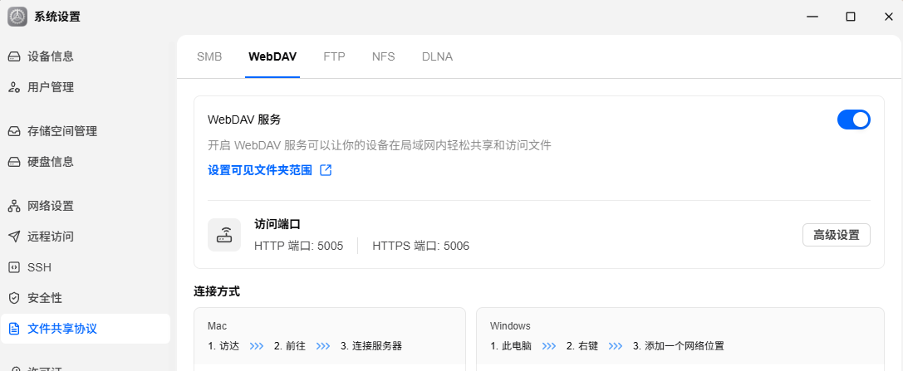
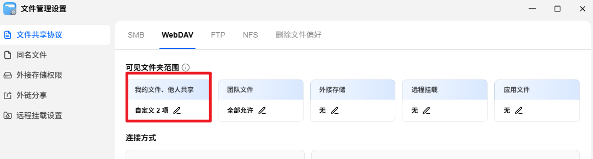
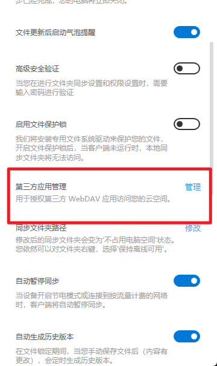
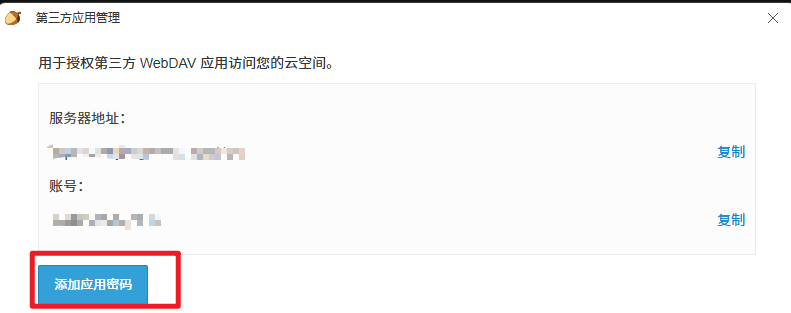
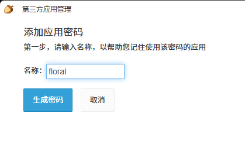

# WebDAV 云同步使用教程

花笺支持通过 **WebDAV** 协议将笔记同步到云端，同时保留人类可读的 Markdown 备份。

以下服务商已实际验证通过：

| 服务商                   | 说明                                                                                                                     | 免费额度                 |
| ------------------------ | ------------------------------------------------------------------------------------------------------------------------ | ------------------------ |
| **坚果云**               | [坚果云官网](https://www.jianguoyun.com/) — 国内最稳定的 WebDAV 服务，需在账户设置中开启第三方应用管理并创建应用专用密码 | 每月 1GB 上传 / 3GB 下载 |
| **飞牛 OS / NAS WebDAV** | NAS 自带 WebDAV，局域网速度快，公网访问需自行解决                                                                        | 取决于硬盘容量           |
| **Nextcloud / ownCloud** | 自建云盘方案                                                                                                             | 取决于服务器             |

其他支持标准 WebDAV 协议的服务理论上都可以使用。如遇兼容性问题，欢迎提交 [Issue](https://github.com/Achilng/floral-notepaper/issues)。

## 飞牛 OS 设置教程

> 目前已在飞牛 OS 上验证通过。其他NAS同理

1. 在飞牛 WebDAV 根目录下创建 `floral-sync` 文件夹用于保存同步数据

2. 开启飞牛 WebDAV 服务
   

3. 设置 `floral-sync` 文件夹的读写权限
   

4. 在花笺中填写 WebDAV 地址、飞牛账号、飞牛密码，点击「测试连接」，成功后开启云同步

## 坚果云设置教程

> 目前已在坚果云上验证通过。

1. 在[坚果云官网](https://www.jianguoyun.com/)下载坚果云客户端并登录

2. 打开坚果云设置，进入「**第三方应用管理**」
   

3. 点击「**添加应用密码**」
   

4. 名称输入 `floral`，生成应用专用密码
   

5. 将**服务器地址**、**坚果云账号**、**应用专用密码**填入花笺，点击「测试连接」，成功后开启云同步

## 同步模式

| 模式         | 触发时机         | 说明                                                       |
| ------------ | ---------------- | ---------------------------------------------------------- |
| **启动同步** | 应用启动时       | 自动拉取远端最新变更                                       |
| **自动上传** | 本地修改笔记后   | 停止输入约 10 秒后自动上传，持续输入时最长每 60 秒上传一次 |
| **定时拉取** | 按设置的同步间隔 | 周期性检查远端是否有新变更                                 |
| **手动同步** | 点击「立即同步」 | 立即执行完整的双向同步                                     |
| **退出同步** | 关闭应用时       | 退出前补一次同步，确保最新改动不丢失                       |

> **提示**：如果关闭「启用自动同步」，笔记只会保存在本地。只有点击「立即同步」时才会手动上传到云端。

## 远端目录结构

同步后，你的 WebDAV 空间会出现以下目录：

```
你的WebDAV根目录/
└── floral-sync/              ← 同步根目录（自动创建）
    ├── notes/                ← 人类可读的 Markdown 备份
    │   ├── 笔记ID__标题.md
    │   └── 分类名/
    │       └── 笔记ID__标题.md
    └── floral-sync-meta/     ← 同步元数据（程序使用）
        ├── manifest.json     ← 远端清单
        └── archive/          ← 已删除笔记归档
```

> `notes/` 目录下的 `.md` 文件可以直接用任何编辑器打开，保留了你的笔记内容和分类结构。

## 冲突处理

当两台设备同时编辑了同一条笔记，花笺采用 **"最后写入者胜出 + 自动备份"** 策略：

- 时间戳更新的一方成为主版本
- 被覆盖的一方自动另存为「**笔记名 冲突副本 YYYY-MM-DD HH-MM**」的本地笔记
- 不会静默丢失任何一方的修改

## 常见问题

### Q：测试连接成功，但同步时报"拒绝了当前操作"？

检查 WebDAV 账户是否有**写入权限**

### Q：提示"无法自动创建 floral-sync 文件夹"？

部分 WebDAV 服务限制了自动创建文件夹。请在 WebDAV 根目录下**手动创建**名为 `floral-sync` 的文件夹，确保有读写权限。

### Q：删除的笔记又回来了？

如果你在设备 A 删除了笔记但还没同步，设备 B 先同步了（此时笔记还在），设备 B 会把笔记推回远端。解决方法：在任意一台设备上删除后，**先点立即同步**，再到另一台设备同步。

### Q：同步后远端有多余的残留文件？

正常情况下花笺会自动清理旧文件。如果因网络中断导致残留，可以手动删除 `notes/` 下多余的 `.md` 文件，下次同步会自动修复。

### Q：密码安全吗？

密码以混淆形式存储在本地 `config.json` 中，不会以明文落盘。混淆旨在避免直观暴露，不应视为强加密。

### Q：切换 WebDAV 服务或账号后怎么办？

直接在设置中修改 WebDAV 地址和账号密码，点击「立即同步」即可。花笺会为新远端创建独立的同步目录，旧的远端数据不会自动删除。

### Q：自动同步的频率是多少？

- **上传**：停止输入约 10 秒后触发，持续输入时最长 60 秒强制上传一次
- **拉取**：按设置的「同步间隔」（默认 300 秒 = 5 分钟）周期性检查远端
- 应用启动和退出时会各补一次完整同步
